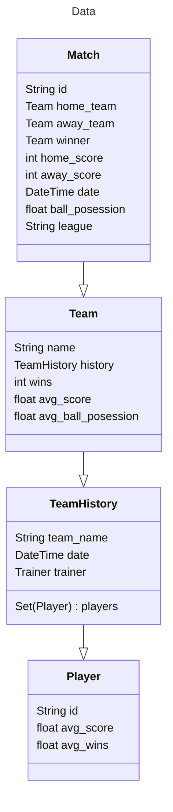

```mermaid
---
title: Data
---
classDiagram

Match --|> Team
Team --|> TeamHistory
TeamHistory --|> Player

class Match{
    String id <hash team names und date>
    Team home_team
    Team away_team
    Team winner
    int home_score
    int away_score
    DateTime date
    float ball_posession
    String league
}

class Team{
    String name
    TeamHistory history
    int wins
    float avg_score
    float avg_ball_posession
}

class TeamHistory{
    String team_name
    DateTime date
    Set(Player) players
    Trainer trainer
}

class Player{
    String id
    float avg_score
    float avg_wins
}
```